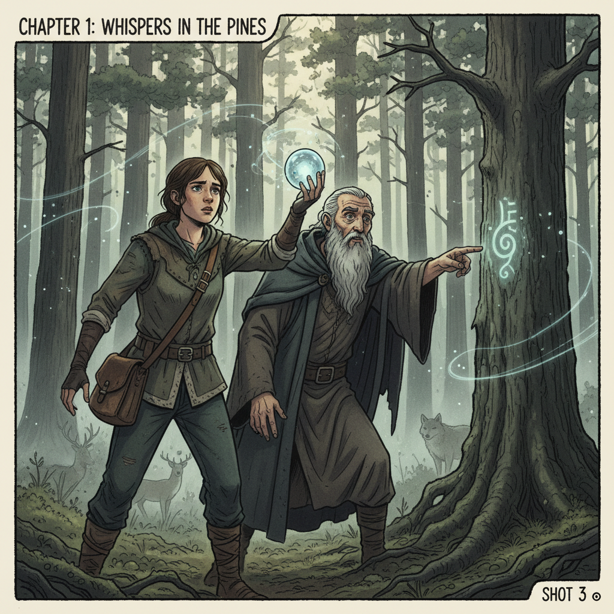

# 🎬 PlotPanel: AI Storyboard Generator

Note: This project is a proof-of-concept. The current Google Gemini API integration generates textual descriptions of scenes, not final images. See the Limitations section for details.

PlotPanel is a web-based application that leverages the power of Google's Gemini AI to automatically conceptualize storyboard visuals from a written script. This tool is perfect for filmmakers, content creators, and writers who want to quickly visualize their stories.

## ✨ Features
🤖 AI Script Analysis: Utilizes Google's Gemini Pro model to interpret your script and generate corresponding textual descriptions of each scene.

🖥️ Simple Web Interface: An intuitive and easy-to-use interface for entering your script and viewing the generated storyboard concepts.

🖼️ Dynamic Concept Grid: The generated concepts are displayed in a clean, responsive grid layout.

🔄 Loading State: Provides clear feedback to the user while the AI is processing the script.

🚫 Placeholder Support: A placeholder is shown for each scene description, ensuring the storyboard flow is not interrupted.

🚀 How to Use
1️⃣ Enter Your Script: Open the PlotPanel web application. In the text area, enter your script with each line representing a different scene or shot.

2️⃣ Generate Storyboard: Click the "Generate Storyboard" button.

3️⃣ View Your Concepts: The application will process your script and display the AI-generated descriptions in a grid.

## 🛠️ Setup & Local Installation
Follow these steps to run PlotPanel on your local machine.

1. Clone the Repository
Bash

git clone https://github.com/your-username/plotpanel.git
cd plotpanel
2. Create and Activate a Virtual Environment
macOS / Linux:

Bash

python3 -m venv venv
source venv/bin/activate
Windows:

Bash

python -m venv venv
.\venv\Scripts\activate
3. Install Dependencies
Install all required packages from the requirements.txt file.

Bash

pip install -r requirements.txt
(See the Technologies Used section for the contents of this file.)

4. Set Up Environment Variables
Create a file named .env in the root of the project. Add your Google Gemini API key to this file:

Ini, TOML

GEMINI_API_KEY=your_api_key_here
5. Run the Application
Bash

python app.py
Open your web browser and navigate to http://127.0.0.1:5000.

## 💻 Technologies Used
⚙️ Backend
Flask: A lightweight WSGI web application framework in Python.

google-generativeai: The Python library for the Google Gemini API.

python-dotenv: Manages environment variables from a .env file.

Pillow: Used for image manipulation (intended for future image support).

🎨 Frontend
HTML5

CSS3

JavaScript

Font Awesome: For icons.

requirements.txt Content
Plaintext

Flask
google-generativeai
python-dotenv
Pillow
## ⚠️ Limitations
The most important limitation to be aware of is that the current version of the google-generativeai library and the gemini-2.5-flash-image model do not support direct text-to-image generation.

The model will return a textual description of the requested image, not the image itself.

The application is set up to handle and display image data, but for now, it will display a placeholder for each scene. The model's actual text response is printed to the console for debugging and review.

For actual text-to-image generation with Google's models, you would typically need to use the Vertex AI SDK with a model like Imagen.

## 📈 Future Improvements
✅ Integrate a Text-to-Image Model: The top priority is to integrate a true text-to-image model (like Imagen via Vertex AI) to generate actual images.

🎨 Style Customization: Allow users to customize the style of the generated images (e.g., "photorealistic," "sketch," "anime").

📄 Export Options: Add the ability to save and export the generated storyboard as a PDF or a set of image files.

👤 User Accounts: Implement user accounts and project management to save and organize multiple storyboards.

## 🤝 Contributing
Contributions are welcome! Please feel free to open an issue or submit a pull request to improve PlotPanel.

## 🧑‍💻 Developer
Melwin Jude L
🎓 Final-Year BE CSE Student | Jeppiaar Engineering College, Chennai

## 📄 License
This project is for educational and personal portfolio purposes only.
